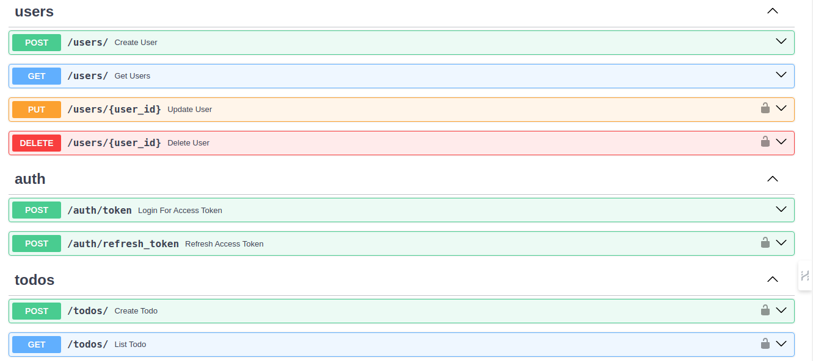

# Fast Todo



Gerenciador de tarefas com boas práticas do FastAPI

> **Nota:** Esse projeto foi feito com base no
> [Curso Básico de FastAPI do Zero](https://fastapidozero.dunossauro.com)

## Como Usar

Inicie o projeto com o `docker-compose`

```sh
docker-compose up
```

Ao iniciar o projeto vá em http://localhost:8000/docs para ver toda a sua documentação

Passos iniciais:

1. Crie um usuário em `POST /users/ Create User`
2. Logue com esse usuário clicando em `Authorize`
3. Quando logado o usuário pode gerenciar suas informações e tarefas

> **Obs:** O `username` é o `email`
> _Exemplo:_
> 
> username:
> user@example.com
> 
> password:
> user12345

## Boas Práticas

- [x] Desenvolvimento baseado em testes (TDD)
- [x] Injeção de dependências
- [x] Banco de dados evolutivo (Migrations)
- [x] ORM com SQLAlchemy
- [x] Conteinerização do Projeto
- [ ] Integração Continua (CI/CD)
- [ ] Deploy no Fly.io

## Contribua com o desenvolvimento

### Dependências

- [Python3.11.6](https://www.python.org/downloads)
  - Pode ser usado com o [pyenv](https://github.com/pyenv/pyenv)
- [Poetry](https://python-poetry.org/docs/#installation)
  - Gerencia o projeto e suas dependências
- [Docker](https://www.docker.com)
  - Gerencia o ambiente da aplicação

### Iniciar aplicação em desenvolvimento

```shell
# Crie o .env com base no .env.example e o modifique
cp .env.example .env

# Instale as dependências do projeto
poetry install

# Entre no ambiente virtual (.venv)
poetry shell

# Crie banco de dados e suas tabelas
task db_init

# Inicie o projeto
task run
```

### Automação de tarefas

```shell
# Inicia a verificação de estilo do código
task lint

# Inicia as correções do estilo do código
task fix

# Inicia os testes
task test

# Gera um arquivo de cobertura de testes em html
task post_test

# Cria uma nova migração
task db_migration -m '<mensagem>'

# Cria o banco de dados
task db_init

# Atualiza a próxima migração
task db_up +1

# Retorna a migração anterior
task db_down -1

# Inicia o projeto
task run
```

### Git Flow

Utilizando alguns padrões do
[conventional commits em português](https://www.conventionalcommits.org/pt-br/v1.0.0)

- Commits
  - Escopo: `<ação>: <mensagem>`
  - Exemplo: `feat: criação de crud em /users`
- Branches
  - Escopo: `<ação>-<usuário>-<mensagem>`
  - Exemplo: `feat-brunodavi-crud-da-rota-users`
- Pull Requests
  - Escopo: `[ <AÇÃO> ] <Titulo>`
  - Exemplo:`[ FEAT ] Criação de CRUD na rota de usuários`
- Issues
  - Regras: 
    - 1. Veja se o problema já foi resolvido
    - 2. Descreva o que aconteceu e o que você já tentou fazer
  - Escopo: `<Titulo>`
  - Exemplo: `Ouve um problema na criação de usuários`
